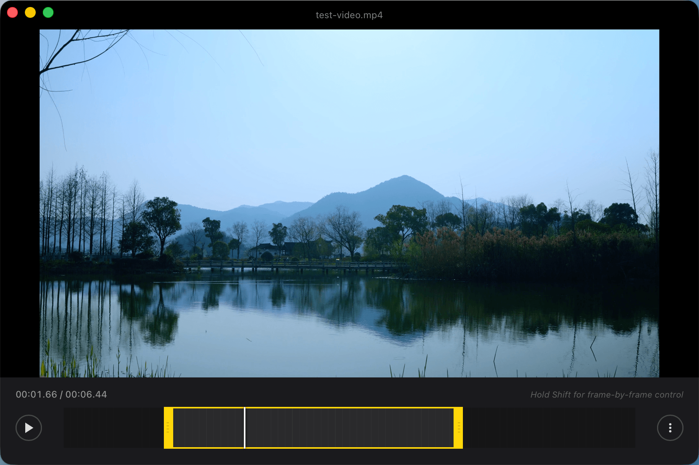
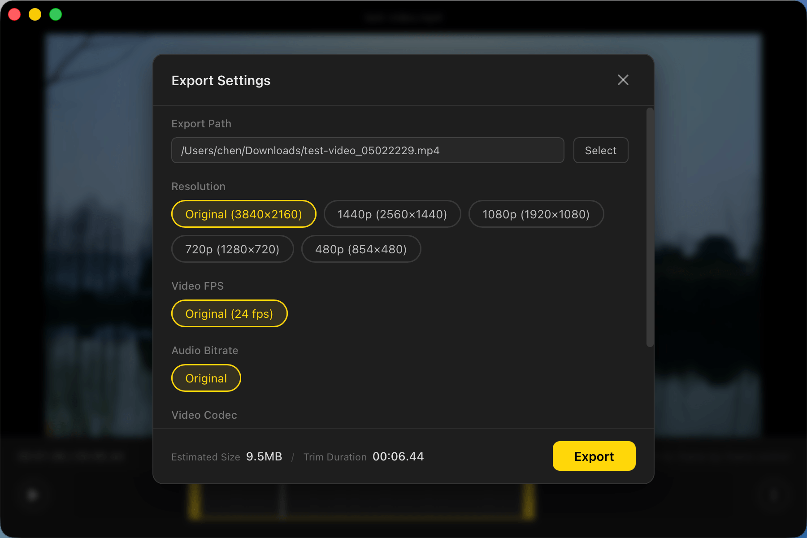

# TinyCut

<div style="text-align: center">

**一款轻量级、开源、跨平台的视频剪辑应用**

[](https://github.com/peakchen90/tiny-cut/releases)
[](LICENSE)
[]()

**[English](README.md)** | 中文

</div>

<div style="text-align: center">
  
  
</div>

## 功能特性

- **简洁直观** — 界面清爽，专注核心功能
- **快速剪切** — 无需重新编码，保留原始画质
- **精准剪切** — 逐帧精确裁剪，重新编码
- **拖拽支持** — 直接拖拽视频文件到窗口
- **内置 FFmpeg** — 无需安装外部依赖
- **GPU 加速** — 支持硬件编码（macOS 使用 VideoToolbox，Windows 使用 NVENC）
- **隐私安全** — 所有处理均在本地完成
- **跨平台** — 支持 macOS（Intel 和 Apple Silicon）和 Windows

## 支持格式

TinyCut 支持以下视频格式：

| 格式 | 扩展名 |
|------|--------|
| MP4 | `.mp4` |
| MOV | `.mov` |
| AVI | `.avi` |
| MKV | `.mkv` |
| WebM | `.webm` |
| FLV | `.flv` |
| WMV | `.wmv` |
| M4V | `.m4v` |
| 3GP | `.3gp` |

## 下载安装

从 [Releases](https://github.com/peakchen90/tiny-cut/releases) 页面下载适合您平台的最新版本。

| 平台 | 架构 | 文件 |
|------|------|------|
| macOS | Apple Silicon (M1/M2/M3) | `TinyCut_aarch64.dmg` |
| macOS | Intel | `TinyCut_x64.dmg` |
| Windows | x64 | `TinyCut_x64-setup.exe` |

> **macOS 用户**：如果打开时提示"应用已损坏"，请执行以下命令：
> ```
> xattr -cr /Applications/TinyCut.app
> ```

## 使用方法

### 基本操作

1. 启动 TinyCut
2. 将视频文件拖拽到窗口，或点击选择文件
3. 使用时间轴设置起始点和结束点
4. 点击菜单 (⋮) 选择 **导出**
5. 选择保存位置，等待处理完成

### 导出设置

在导出弹窗中，您可以：

- **选择导出位置**：点击"选择"按钮设置保存路径
- **调整分辨率**：支持原始、4K、1440p、1080p、720p、480p
- **调整帧率**：支持原始、60fps、30fps、25fps、24fps
- **选择格式**：支持 MP4 和 MOV
- **预估大小**：实时预估导出文件大小

### 快捷键

| 按键 | 功能 |
|------|------|
| `空格` | 播放 / 暂停 |
| `←` | 后退 0.2 秒 |
| `→` | 前进 0.2 秒 |
| `Shift + ←` | 后退 2 秒 |
| `Shift + →` | 前进 2 秒 |
| `⌘/Ctrl + N` | 新建项目 |
| `⌘/Ctrl + I` | 视频信息 |
| `⌘/Ctrl + E` | 导出 |
| `Esc` | 关闭弹窗 |

### 视频信息

点击 **更多 (⋮) → 信息** 可查看视频详细信息：

- 文件名和文件大小
- 分辨率和帧率
- 视频编码和色彩空间
- 码率和时长
- 音频编码、采样率、声道数和码率

### 拖拽支持

在任意界面都可以直接拖拽视频文件到窗口，自动加载新视频：

- 支持格式：MP4、MOV、AVI、MKV、WebM、FLV、WMV、M4V、3GP
- 支持单个文件拖拽

## 开发指南

### 环境要求

- [Node.js](https://nodejs.org/) >= 18
- [Yarn](https://yarnpkg.com/) 1.x
- [Rust](https://www.rust-lang.org/tools/install) (stable)

### 快速开始

```bash
# 克隆仓库
git clone https://github.com/peakchen90/tiny-cut.git
cd tiny-cut

# 安装前端依赖
yarn install

# 启动开发服务器
yarn tauri:dev
```

### 构建打包

```bash
# 构建生产版本
yarn tauri:build
```

构建产物位于 `src-tauri/target/release/bundle/` 目录。

## 技术栈

| 层级 | 技术 |
|------|------|
| 前端 | React, TypeScript, Vite |
| 后端 | Rust, Tauri v2 |
| 视频处理 | FFmpeg（内置） |
| GPU 加速 | VideoToolbox (macOS), NVENC (Windows) |

## 项目结构

```
tiny-cut/
├── src/                    # 前端源码
│   ├── components/         # React 组件
│   ├── lib/                # 工具函数（国际化、时间处理）
│   └── types/              # TypeScript 类型定义
├── src-tauri/              # Rust 后端
│   ├── src/                # Rust 源码
│   ├── binaries/           # 内置的 FFmpeg 二进制文件
│   └── capabilities/       # Tauri 权限配置
├── docs/                   # 文档
└── .github/                # GitHub 工作流和模板
```

## 参与贡献

欢迎贡献代码！请参阅 [CONTRIBUTING.md](CONTRIBUTING.md) 了解贡献指南。

## 开源协议

本项目基于 MIT 协议开源 - 详见 [LICENSE](LICENSE) 文件。

### FFmpeg 协议

TinyCut 内置了 FFmpeg 二进制文件。FFmpeg 基于 [GNU Lesser General Public License (LGPL) v2.1](https://www.gnu.org/licenses/old-licenses/lgpl-2.1.html) 或更高版本，或 [GNU General Public License (GPL) v2](https://www.gnu.org/licenses/old-licenses/gpl-2.0.html) 或更高版本开源，具体取决于构建配置。详见 [docs/ffmpeg-license.md](docs/ffmpeg-license.md)。

## 致谢

- [Tauri](https://tauri.app/) — 优秀的桌面应用框架
- [FFmpeg](https://ffmpeg.org/) — 强大的视频处理能力
